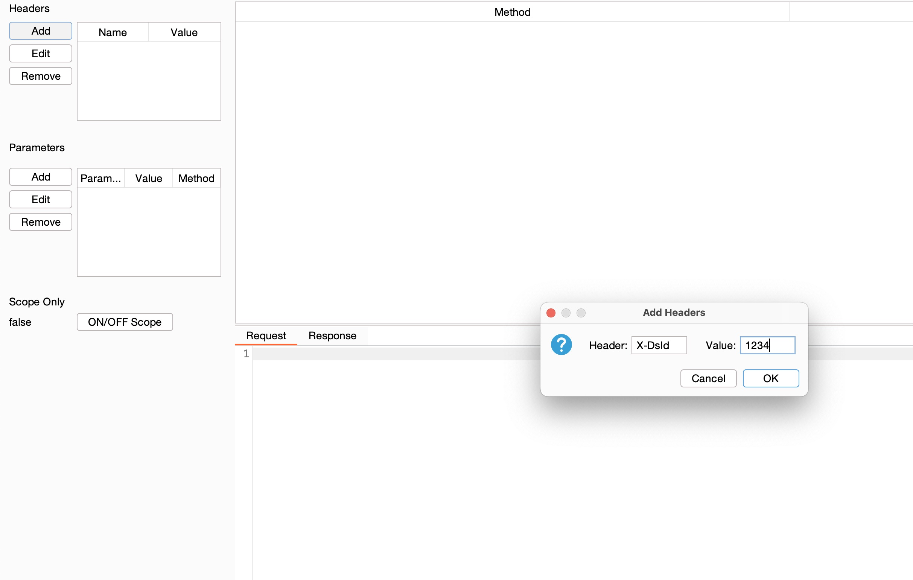
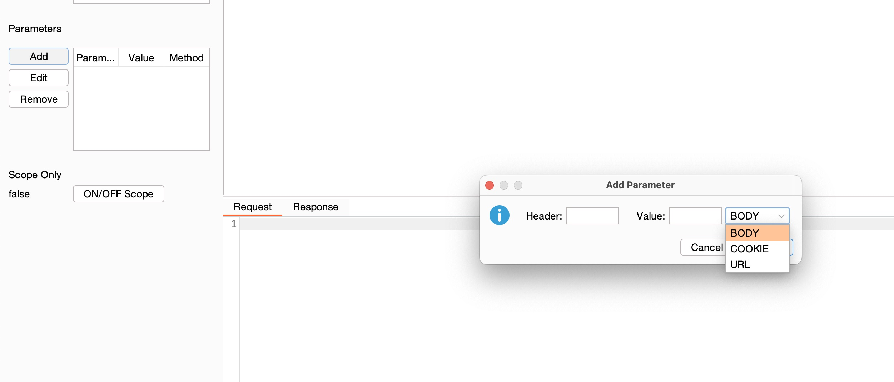

# Custom Headers and Parameters Burp Extension

This is a Burp Suite extension that allows you to add custom headers and parameters to every request.
This extension is useful for testing IDOR bugs.
You can add customised headers and parameters (body, get, cookies) with this extension.

# Installation

You can build manually with below instructions.

1. Clone this repo.
2. run `gradle build`
3. Once you run above command. A JAR file will generated in "build/libs/app.jar".
4. Add this jar in your burp.

If you don't want to build yourself. Simply download pre compiled JAR file in released tab and add in your burp suite.

# Add Header

# Add Parameter

You can choose what parameters to add in the request. Currently support URL, COOKIE and BODY.

# Scope

If you want to insert only in-scope item, simply click "ON/OFF Scope" button. Requests outside of scope will be added.
